### I lead the frontend at Holded.

I own its architecture, lead the team's projects, and hire and train the people
who join. Before Holded I spent six years as a full-stack developer, starting as
an intern in Jerez.

I finished LIDR's tech leadership master first in my cohort, and I never stopped
writing code: 4,400+ contributions in the last year.

### And on weekends, I launch things.

AniJams took one weekend to build and has been live every day since: designed, built and shipped
end to end, with no framework and no ads.

Hiring, building something, or want to talk frontend leadership? Find me on
[LinkedIn](https://www.linkedin.com/in/vicente-torres-aragon/), on [X](https://x.com/bcentdev)
or at [iam@vicentetorr.es](mailto:iam@vicentetorr.es).
