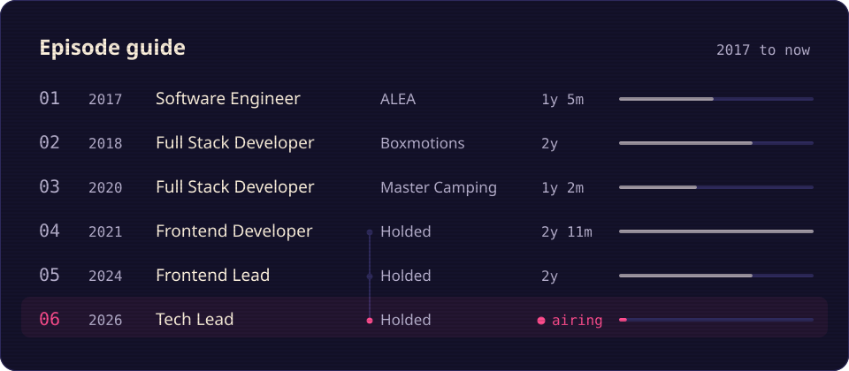

I'm a Tech Lead at [Holded](https://www.holded.com) in Barcelona. I joined in 2021 as a frontend
developer, became frontend lead in 2024 and tech lead in 2026. The job is the frontend
architecture, leading frontend projects, training the team and hiring the people who join it.

Before Holded I spent four years as a full stack developer at ALEA, Boxmotions and Master Camping.
In 2024 I finished LIDR's tech leadership master at the top of my cohort.

On the side I build small products end to end, from the idea to the deploy.

Upstream, I translated [`cloneElement`](https://github.com/reactjs/es.react.dev/pull/597) for the
Spanish React docs and added [custom YAML output](https://github.com/i18next/i18next-parser/pull/626)
to i18next-parser.

Find me on [LinkedIn](https://www.linkedin.com/in/vicente-torres-aragon/), on
[X](https://x.com/bcentdev) or at [iam@vicentetorr.es](mailto:iam@vicentetorr.es).
